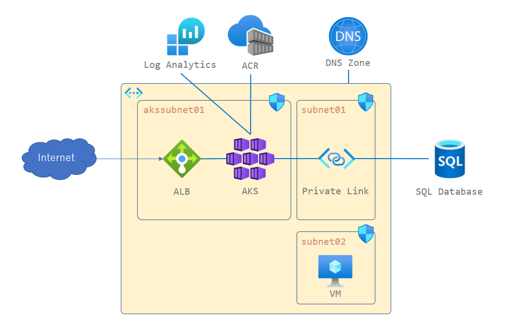
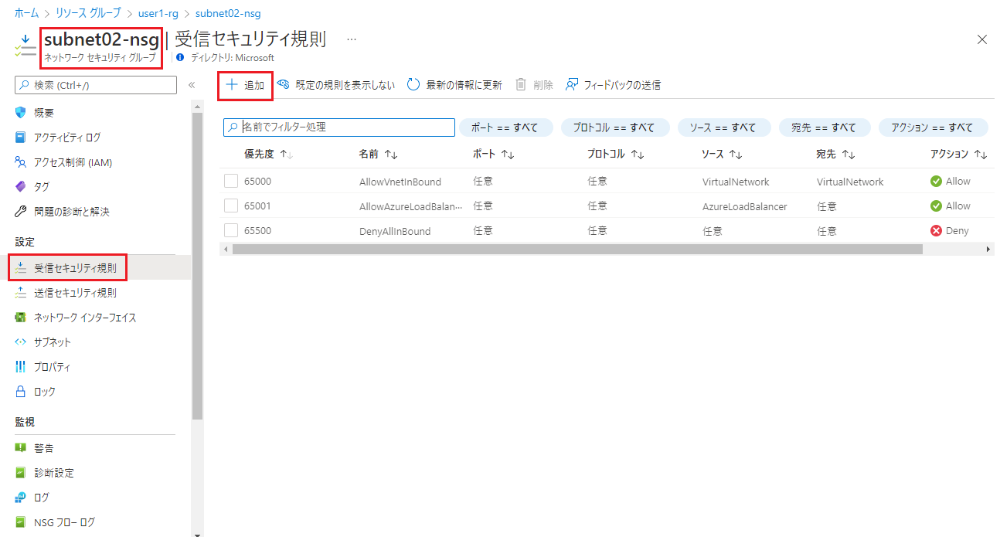
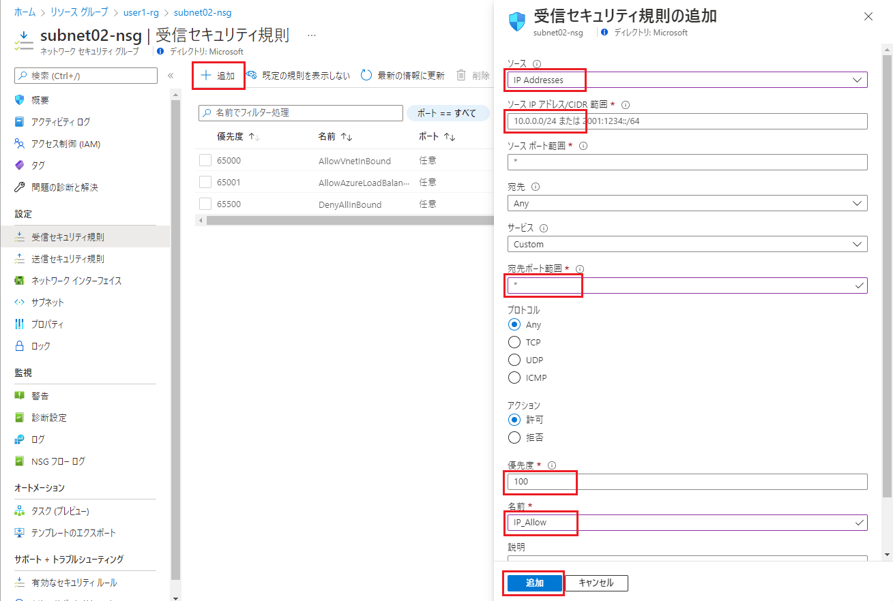

# AKS トラブルシューティングハンズオン

## 目的

このハンズオンでは、Azure Kubernetes Service(AKS)に関連したトラブルシューティング知識を身につけます。

## 対象のサービス

- Azure Kubernetes Service
- SQL Database
- アプリケーション

## アーキテクチャ

本ワークショップで使用する POC 環境の構成は以下の図の通りとなります。



## Requirements

+ クライアント端末が Azure ポータルへアクセスできること
+ クライアント端末が Azure VM に対して ssh 接続可能であること (Port 22 Outbound 許可)
+ POC 環境が構築されていること
  + [構築手順](/terraform/README.md)

## 準備

1. [Azure ポータルサイト](https://portal.azure.com/)へログインします。
2. ご自身のリソースグループに移動し、「subnet02-nsg」を選択します。
3. 「受信セキュリティ規則」項目にて、「受信ポートの規則を追加する」を選択します。
   
4. 「受信セキュリティ規則の追加」にて、以下の情報を入力し、「追加」をクリックします。
   - ソース：IP Addresses
   - ソース IP アドレス/CIDR 範囲：ご自身の外部 IP
   - 宛先ポート範囲：*
   - 優先度：100 ～ 4096 の任意の数値(若い方が優先度高い)
   - 名前：任意適切な名前
   
5. 手順 2.~ 4. で、「akssubnet01-nsg」を同じように設定します。
6. ssh で Linux 環境へ接続します。
   - ユーザー名：azureuser
   - パスワード：PaSsW0rd0000
7. 接続後、以下のコマンドで、GitHub から最新のファイルを pull します。
   ```bash
   cd aks-troubleshooting-workshop-public
   git pull
   ```
8. Azure CLI でログインします。
   - `az login`
9. AKS へ接続します。
   - `az aks get-credentials --resource-group <リソース グループ名> --name demoaks01`

## ログイン情報

### SQL Database

- ユーザー名：4dm1n157r470r
- パスワード：4-v3ry-53cr37-p455w0rd

[terraform を参照](/terraform/modules/SQLServer/main.tf)

### VM (Ubuntu)

- ユーザー名：azureuser
- パスワード：PaSsW0rd0000

[terraform を参照](/terraform/modules/VirtualMachine/variables.tf)

## ハンズオン

このハンズオンでは、Azure Kubernetes Services(AKS) にアプリケーションを展開するときによくあるトラブルシューティングを練習します。
複数のシナリオで構成されており、Kubernetes における問題、アプリケーションにおける問題が用意されています。

シナリオごとに namespace を作成し、その中に必要なリソースを展開します。

アプリケーションは、Node.js を利用しています。アプリケーションの説明は [こちら](/app) を参照してください。

以下はフォルダ構成です。

```
.
├── app         # アプリケーションが格納されているフォルダです。
├── scenarioXX  # シナリオの説明が格納されているフォルダです。
└── terraform   # ハンズオン環境を構築するための Terraform が格納されているフォルダです。
```

- [シナリオ 1 : Pod が起動しない(難易度: ★)](/scenario01/)
- [シナリオ 2 : Pod が停止する(難易度: ★)](/scenario02/)
- [シナリオ 3 : Pod が Pending のままとなる(難易度: ★★)](/scenario03/)
- [シナリオ 4 : Web アプリケーションに接続できない(難易度: ★★)](/scenario04/)
- [シナリオ 5 : Web アプリケーションへアクセスしたときにエラーが発生する(難易度: ★★★)](/scenario05/)
- [シナリオ 6 : Web アプリケーションの画面表示が遅い(難易度: ★★★★)](/scenario06/)

