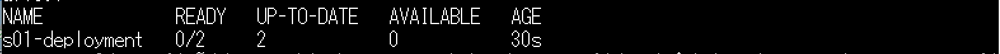

# シナリオ 1：イメージ ダウンロード失敗

## 演習の概要と目的

Kubernetes のワークロードを初めて展開する際に、いきなりうまく動作しないケースがよくみられます。その中でも、原因がシンプルですが、よく出会って、かつ原因究明するまでに時間がかかってしまうものがあります。このシナリオでは、ワークロード展開後の一般的な問題のトラブルシューティングの手法を覚えておきましょう。

この演習では、ワークロードのデプロイ後に発生するトラブルに対して、コマンドを用いてワークロードのトラブルシューティングを行います。コマンドの結果を確認し、トラブルの原因を究明します。

### 演習の流れ

1. まず、用意されている yaml ファイルを使って、ワークロードを展開します。
2. 展開したワークロードに対して、コマンドで状態確認をします。
3. 異常のワークロードを特定し、さらに詳細な情報をコマンドで確認します。
4. コマンドの出力結果から、トラブルの可能性となるポイントに対して、修正します。

## 準備

1. 以下のコマンドを実行し、yamls ファイルから ワークロードを作成します。
  ```bash
  kubectl apply -f ./aks-troubleshooting-workshop-public/scenario01/yamls/s01-deployment.yaml
  ```

※ 本シナリオは `DockerHub` の `Wordpress` 公式イメージを利用しています。

## 現象の確認

1. deployment の状況確認
  ```bash
  # deployment の状況確認
  kubectl get deployment -n scenario01
  ```
  - 結果例：
2. Pod の状況確認
  ```bash
  # Pod の状態確認
  kubectl get pods -n scenario01
  ```
 - 結果例：

## ゴール
エラーを解消する。

## ヒント

<details>
    <summary>コンテナの詳細情報を確認する</summary>

+ Pod の詳細情報を確認してみます。
+ 仮説の問題点箇所を探します。
```
kubectl describe pods <pod名> -n scenario01
例)
kubectl describe pods sampleapp-fd4d45b84-2nxb5 -n scenario01
```
</details>

<details>
    <summary>yaml ファイルを確認する</summary>

- `s01-deployment.yaml` を開き、原因となる箇所を調べてみましょう。
- 変更したマニュフェストファイルを修正して、環境に適用します。
  ```bash
  kubectl apply -f ./aks-troubleshooting-workshop-public/scenario01/yamls/s01-deployment.yaml
  ```
- 修復できたかの確認をします。
  - Pod が `Running` 状態になることを確認します。

</details>


## 環境のクリーンアップ

```bash
# 指定の namespace のリソースをクリーンアップ
kubectl delete all --all -n scenario01
```

## 回答

<details>
    <summary>ここを展開してください</summary>

### トラブルについて

- トラブル原因：イメージ タグの指定ミスによるイメージダウンロード失敗
- `kubectl describe` コマンド結果例 (抜粋)：
  ```
  Events:
  Type     Reason     Age                From               Message
  ----     ------     ----               ----               -------
  Normal   Scheduled  61s                default-scheduler  Successfully assigned scenario01/s01-deployment-698dc4b7d8-fwtss to aks-agentpool-18548444-vmss000000
  Normal   BackOff    21s (x2 over 53s)  kubelet            Back-off pulling image "wordpress:latast"
  Warning  Failed     21s (x2 over 53s)  kubelet            Error: ImagePullBackOff
  Normal   Pulling    9s (x3 over 60s)   kubelet            Pulling image "wordpress:latast"
  Warning  Failed     5s (x3 over 54s)   kubelet            Failed to pull image "wordpress:latast": rpc error: code = NotFound desc = failed to pull and unpack image "docker.io/library/wordpress:latast": failed to resolve reference "docker.io/library/wordpress:latast": docker.io/library/wordpress:latast: not found
  Warning  Failed     5s (x3 over 54s)   kubelet            Error: ErrImagePull
  ```
- トラブル箇所：`s01-deployment.yaml` ファイルの L20 `image: wordpress:latast` のタグのスペルミス
- 修復方法：
  1. `s01-deployment.yaml` の L20 `image: wordpress:latast` → `image: wordpress:latest` に修正します。
  2. もう一度デプロイを実施します。
    ```bash
    kubectl apply -f ./aks-troubleshooting-workshop-public/scenario01/yamls/s01-deployment.yaml
    ```
  3. Pod が正常起動できたことを確認します。

### タグについての解説

イメージのタグはイメージの重要な識別しで、イメージをダウンロードする際に必ず必要とする情報になります。</br>

タグを間違って指定した場合、イメージが見つからなくなり、ダウンロースが失敗します。</br>
指定なしの場合、デフォルトは `latest` になります。</br>

このシナリオでは `latest` タグを使用しましたが、運用環境では基本 `latest` タグのみの指定は推奨しません。</br>

原因としては、`latest` のみを指定した場合、Kubernetes にはイメージキャッシュの機能があって、イメージ更新したとしても、キャッシュにある古いイメージと同じものとして認識されてしまいます。</br>

よって、結果的にデプロイされたワークロードが古いイメージを使ってしまうトラブルが発生しやすいためです。</br>

タグの命名規則は標準がなく、ユーザーのポリシーによりますが、（Docker Hub）の有名なものを参考していただいたほうがよいかと存じます。</br>
（例：複数タグを付けるのも結構一般的なパターン）

</details>
