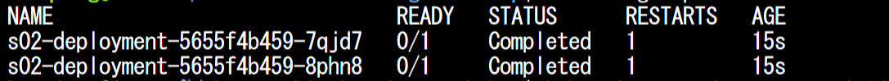

# シナリオ 2：Pod が停止する

## 演習の概要と目的

Kubernetes のワークロードを初めて展開する際に、いきなりうまく動作しないケースがよくみられます。その中でも、原因がシンプルですが、よく出会って、かつ原因究明するまでに時間がかかってしまうものがあります。このシナリオでは、ワークロード展開後の一般的な問題のトラブルシューティングの手法を覚えておきましょう。

この演習では、ワークロードのデプロイ後に発生するトラブルに対して、コマンドを用いてワークロードのトラブルシューティングを行います。コマンドの結果を確認し、トラブルの原因を究明します。

### 演習の流れ

1. まず、用意されている yaml ファイルを使って、ワークロードを展開します。
2. 展開したワークロードに対して、コマンドで状態確認をします。
3. 異常のワークロードを特定し、さらに詳細な情報をコマンドで確認します。
4. コマンドの出力結果から、トラブルの可能性となるポイントに対して、修正します。

## 準備

1. `./scenario02/yamls/s02-deployment.yaml` ファイルの修正
  ```
  行：image: demoacr01sufdc1861b5996e0a90.azurecr.io/sample/s02image:latest
  demoacr01sufdc1861b5996e0a90 → ご自身の ACR 名に書き換えてください。
  ```
2. 以下のコマンドを実行し、yamls ファイルから Kubernetes のリソースを作成
  ```bash
  kubectl apply -f ./scenario02/yamls/s02-deployment.yaml
  ```

## 現象の確認

1. deployment の状況確認
  ```bash
  # deployment の状況確認
  kubectl get deployment -n scenario02
  ```
2. Pod の状況確認
  ```bash
  # Pod の状態確認
  kubectl get pods -n scenario02
  ```
  - デプロイ直後、Pod の状態が `Completed` と表示されます。
  
  - 最終的に `CrashLoopBackOff` 状態に遷移します。
  

## ゴール
エラーを解消する。

## ヒント

<details>
    <summary>コンテナのログを確認する</summary>

+ Pod の状態を出力して、状態の遷移を確認します。
  + `Complete` 状態は、コンテナが実行しているプロセスが正常終了したことを意味します。
  + 常時起動のコンテナのプロセスは終了しないプロセスにする必要があります。
+ Pod の詳細情報を確認してみます。
  + コンテナの再起動が数回発生しています。
+ Pod の状態とログを確認します。
  ```bash
  # Pod の詳細情報確認
  # kubectl describe pods <pod名> -n scenario01
  # 例)
  kubectl describe pods sampleapp-fd4d45b84-2nxb5 -n scenario02

  # Pod の Log の確認
  # kubectl logs <Pod 名> -f ※ -f を付けることでリアルタイムにログを見ることができます。
  # 例)
  kubectl logs sampleapp-fd4d45b84-2nxb5 -f -n scenario02
  ```
+ コンテナのプロセスの起動コマンドは `/app/dumb-init npm start` です。
  + Dockerfile を確認して、イメージはどういう風にプロセスを起動しているかを確認します。
  + コンテナ イメージの `Dockerfile` は `./scenario02/Dockerfiles/Dockerfile` です。
    + Dockerfile の `CMD` でコマンドを実行します。

</details>

<details>
    <summary>Dockerfile の確認</summary>

- `./scenario02/Dockerfiles/Dockerfile` を開き、コンテナの起動プロセスを確認します。

</details>

## トラブルシューティング

※ここから下は自分で答えを見つけてから確認しましょう。

<details>
    <summary>ここを展開してください</summary>

### トラブルについて

- トラブル原因：Pod の停止の原因はコンテナ プロセスの終了によるものです。
- `kubectl describe` コマンド結果例 (抜粋)：
  ```
  Events:
    Type     Reason     Age                From               Message
    ----     ------     ----               ----               -------
    Normal   Scheduled  59s                default-scheduler  Successfully assigned scenario02/s02-deployment-6b5b996589-4m7l4 to aks-agentpool-32430097-vmss000000
    Normal   Pulled     56s                kubelet            Successfully pulled image "demoacr01sufdc1861b5996e0a90.azurecr.io/sample/demoimage:latest" in 2.526956824s
    Normal   Pulled     53s                kubelet            Successfully pulled image "demoacr01sufdc1861b5996e0a90.azurecr.io/sample/demoimage:latest" in 235.475677ms
    Normal   Pulled     39s                kubelet            Successfully pulled image "demoacr01sufdc1861b5996e0a90.azurecr.io/sample/demoimage:latest" in 323.72726ms
    Normal   Created    12s (x4 over 55s)  kubelet            Created container s02-container
    Normal   Started    12s (x4 over 54s)  kubelet            Started container s02-container
    Normal   Pulling    12s (x4 over 59s)  kubelet            Pulling image "demoacr01sufdc1861b5996e0a90.azurecr.io/sample/demoimage:latest"
    Normal   Pulled     12s                kubelet            Successfully pulled image "demoacr01sufdc1861b5996e0a90.azurecr.io/sample/demoimage:latest" in 156.354651ms
    Warning  BackOff    11s (x5 over 52s)  kubelet            Back-off restarting failed container
  ```
- トラブル箇所：`./scenario02/Dockerfiles/Dockerfile` ファイルの起動 プロセス
  - ENTRYPOINT/CMD：コマンドでメイン プロセスを起動します。このプロセスが終了するにつれ、コンテナも終了してしまいますので、プロセスが終了しないようにする必要があります。
  - プロセス完了：本シナリオでは、プロセスを実行完了するものにして例を挙げさせていただいたのですが、実環境の場合、エラーなどの原因で終了する可能性もあります。
- 修復方法：
  1. `./scenario02/yamls/s02-deployment.yaml` ファイルを修正
    - プロセス起動する設定 `spec.template.spec.containers[].command` を追加
      ```yaml
      apiVersion: apps/v1
      kind: Deployment
      metadata:
        name: s02-deployment
        namespace: scenario02
        labels:
          app: s02-app
      spec:
        replicas: 2
        selector:
          matchLabels:
            app: s02-app
        template:
          metadata:
            labels:
              app: s02-app
          spec:
            containers:
            - name: s02-container
              image: demoacr01sufdc1861b5996e0a90.azurecr.io/sample/s02image:latest
              command: [ "/app/dumb-init", "npm", "start" ]  # この行を追加
              ports:
              - containerPort: 80
      ```
  2. 以下のコマンドで deployment を再デプロイします。
    ```bash
    kubectl apply -f ./scenario02/yamls/s02-deployment.yaml
    ```
  3. Pod が `Running` 状態になっていることを確認します。

※ Dockerfile にプロセス起動のコマンドを追加し、イメージをリビルドする方法でも修復が可能です。

### コンテナのプロセスについての解説

コンテナは Pod の中にあります。1つの Pod は基本コンテナ1つを格納することが望ましいです（サイドカー構成の特例もあります）。
コンテナは基本プロセスが動いていることが前提となります。プロセスが終了してしまうと、コンテナも終了します。
そのため、常時起動の Pod には、必ずずっと動き続けるプロセスが必要になります。
プロセスがエラーで中止してしまったり、そもそもメインプロセスが存在しない場合、Pod が停止することになります。

そのほか、注意点としては、コンテナ起動する時に、メイン プロセスは PID 1 のプロセスを避けたほうが良いです。
原因としては、PID 1 のプロセスはシグナル(終了信号など)を受け付けない仕様になっています。
Kubernetes の安全停止のしくみは、シグナルで実現しているので、シグナルを受け付けないことは、いきなり Pod が強制停止してしまうことになります。
※ Kubernetes の安全停止：シグナルを受け付けてから強制停止まで、デフォルト 30 秒の余裕があります。

</details>

## 環境のクリーンアップ

```bash
# 指定の namespace のリソースをクリーンアップ
kubectl delete all --all -n scenario02
```