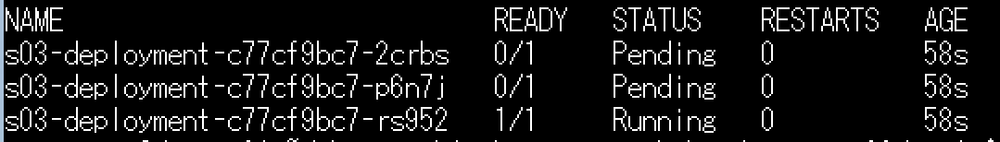
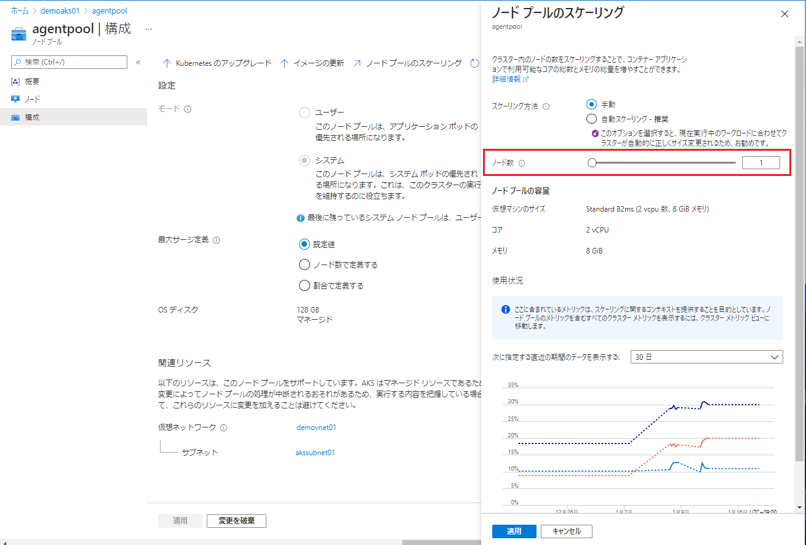
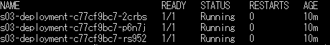

# シナリオ 3：Pod pending 状態

## 演習の概要と目的

Kubernetes のワークロードを展開する際に、サービス自体は提供できるものの、一部のワークロードの状態が Pending のままで、ずっと Running にならない場合があります。
今回は Pending になった Pod に対して、トラブルシューティングの手法を覚えておきましょう。

この演習では、Pending 状態のワークロードに対して、コマンドを用いてワークロードのトラブルシューティングを行います。コマンドの結果を確認し、トラブルの原因を究明します。

### 演習の流れ

1. まず、用意されている yaml ファイルを使って、ワークロードを展開します。
2. 展開したワークロードに対して、状態確認をします。
  - サービスへのアクセス確認
  - コマンドでのワークロードの状態確認
3. 異常 Pod を特定し、さらに詳細な情報をコマンドで確認します。
4. コマンドの出力結果から、トラブルの可能性となるポイントに対して、修正します。


## 準備

1. 以下のコマンドを実行し、yamls ファイルから Kubernetes のリソースを作成
  ```bash
  kubectl apply -f ./scenario03/yamls/
  ```
2. 以下のコマンドを実行し、サービスの外部 IP を確認して、メモします。
  ```bash
  kubectl get services -n scenario03
  ```
  

## 現象の確認

1. deployment の状況確認
  ```bash
  # deployment の状況確認
  kubectl get deployment -n scenario03
  ```
  - 結果例：
2. Pod の状況確認
  + 異常の Pod を確認する
  ```bash
  # Pod の状態確認
  kubectl get pods -n scenario03
  ```
  - 結果例：
3. 準備でメモしたサービスへのアクセス確認
  - http://<サービスのIP>:8080/

## ゴール
エラーを解消する。

## ヒント

<details>
    <summary>コンテナの詳細情報を確認する</summary>

+ 異常 Pod の詳細情報を確認してみます。
+ 仮説の問題点箇所を探します。
```bash
# kubectl describe pods <pod名> -n scenario03
# 例)
kubectl describe pods sampleapp-fd4d45b84-2nxb5 -n scenario03
```
</details>

<details>
    <summary>yaml ファイルを確認する</summary>

- `s03-deployment.yaml` を開き、原因に関連する箇所を調べてみましょう。
- 問題の仮説を立て、修復する処理を行います。
- 修復されているか確認します。
</details>

## トラブルシューティング

※ここから下は自分で答えを見つけてから確認しましょう。

<details>
    <summary>ここを展開してください</summary>

### トラブルについて

- トラブル原因：Node のリソース不足による、Pod の起動不可です。
- `kubectl describe` コマンド結果例 (抜粋)：
  ```bash
  Events:
    Type     Reason            Age                 From               Message
    ----     ------            ----                ----               -------
    Warning  FailedScheduling  5s (x8 over 6m29s)  default-scheduler  0/1 nodes are available: 1 Insufficient cpu.
  ```
- トラブル箇所：ノードのリソース不足
- 修復方法：ノートのスケールアウト
  - このシナリオでは、ノードプールの Node 数を増やすこと (スケールアウト) で対策しています。
  
- スケールアウト後、Pending だった Pod が新しい Node にて正常起動できたことを確認します。
  
  

### Node のリソースについて

AKS のワークロードは仮想マシン(または VMSS)上で構成されます。仮想マシンにスペックがあるように、１つの Node に使用可能なリソースの上限があります。
リソースが足りない場合、ワークロードは Pending 状態、つまりデプロイ待機状態になります。
AKS のワークロードは、お客様のユーザー定義のワークロード以外に、システムのワークロードが稼働しています。
1つの Node 上に、ユーザーのワークロードでどのぐらい使用できるかの計算を設計時に実施することを推奨します。
また、論理値と実際に稼働する時の値に差異が発生する可能性もあるため、本番導入する前に、しっかり検証することを心かけましょう。
AKS の裏で VMSS をご利用の場合、自動スケーリング機能を活用することも１つの選択肢です。

そのほか、ワークロードのスケーリングについて、Node の可用性も考慮すべきポイントになります。
Node を違う可用性ゾーンに置くことで、１つのゾーンにメンテナンスや障害が発生しても、ほかの Node に影響しないので、可用性が向上します。

+ 参考：[kubelet リソースの予約](https://docs.microsoft.com/ja-jp/azure/aks/concepts-clusters-workloads#resource-reservations)

</details>

## 環境のクリーンアップ

1. Kubernetes のリソースのクリーンアップ
  ```bash
  # 指定の namespace のリソースをクリーンアップ
  kubectl delete all --all -n scenario03
  ```
2. ノードプールの設定を戻す
  + Azure ポータルにて、「AKS クラスタ」→「ノード プール」→「agentpool」→「ノード プールのスケーリング」にて、ノード数を 1 に戻す
