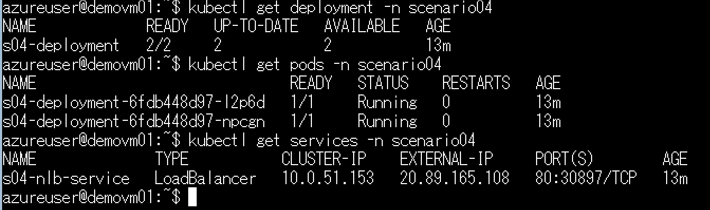
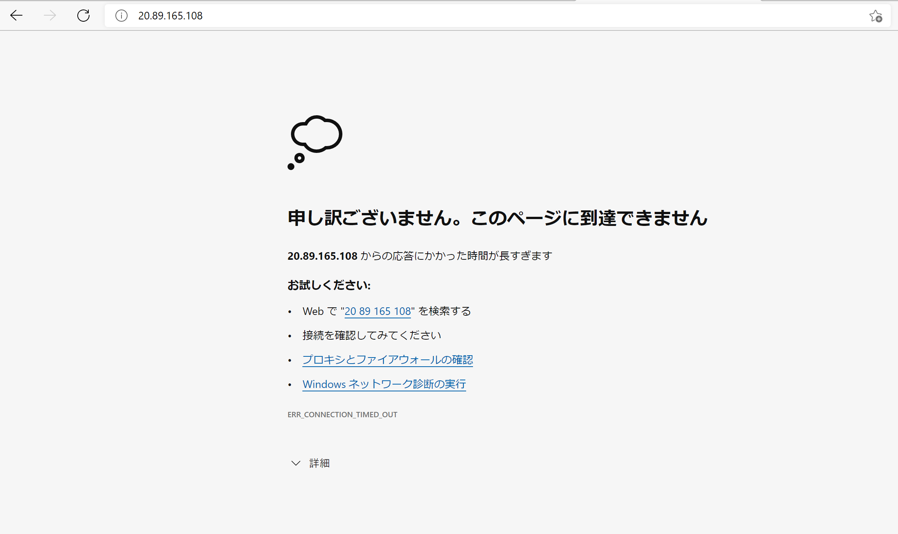

# シナリオ 4：通信不可

## 演習の概要と目的

Kubernetes のワークロードを展開する際に、ワークロードも、サービスも正常に動いているように見えていても、アプリケーションへのアクセスができないトラブルはよくあります。
このような場合、クライアントからサービスへの通信、もしくは、サービスからワークロードへの通信のどちらかで問題があると考えて切り分けします。
このシナリオでは、通信がうまくいかない際に、まずどういう風にトラブルシューティングしていくかを見ていきましょう。

この演習では、ワークロードとサービスが正常に動作している状態で、サービスへのアクセス不可のトラブルに対してトラブルシューティングを行います。
各種リソースを確認しつつ、トラブルの原因を究明します。

### 演習の流れ

1. まず、用意されている yaml ファイルを使って、ワークロードを展開します。
2. 展開したサービスに対して、状態確認をします。
  - サービスへのアクセス確認
  - コマンドでのサービスの状態確認
3. サービスの詳細情報を確認します。
4. コマンドの出力結果から、トラブルの可能性となるポイントに対して、修正します。

## 準備

1. 以下のコマンドを実行し、yamls ファイルから Kubernetes のリソースを作成します。
  ```bash
  kubectl apply -f ./scenario04/yamls/
  ```
2. 以下のコマンドを実行し、サービスの外部 IP を確認して、メモします。
  ```bash
  kubectl get services -n scenario04
  ```
  

## 現象の説明

1. デプロイ状態確認
  - ワークロードとサービスが正常動作していることの確認
  ```bash
  # deployment と pod の状況確認
  kubectl get deployment -n scenario04
  kubectl get pods -n scenario04
  # Service の状態確認
  kubectl get services -n scenario04
  ```
  

2. 準備でメモしたサービスへのアクセス確認
  - http://<サービスのIP>:8080/
  

## ゴール
エラーを解消する。

## ヒント

<details>
    <summary>Pod の詳細情報とサービスの詳細情報を確認する</summary>

- Pod の受け付けポートは 80 です。
- Pod の詳細情報とサービスの詳細情報を確認してみます。
```bash
# Pod デプロイ情報確認コマンド
kubectl describe pods <Pod名> -n scenario04
# Service デプロイ情報確認コマンド
kubectl describe service s04-nlb-service -n scenario04
```
- 仮説の問題点箇所を探します。

</details>

<details>
    <summary>yaml ファイルを確認する</summary>

- `s04-lb-service.yaml` を開き、原因に関連する箇所を調べてみましょう。
- 問題の仮説を立て、修復する処理を行います。
  ```bash
  kubectl apply -f ./scenario04/yamls/
  ```
- 修復されているか確認します。
  - `http://<サービスのIP>:8080/` サイトにアクセスします。
</details>

## トラブルシューティング

※ここから下は自分で答えを見つけてから確認しましょう。

<details>
    <summary>ここを展開してください</summary>

### トラブルについて

- トラブル原因：サービスのターゲット Port がコンテナの受信 Port と違いました。
- `kubectl describe` コマンド結果例 (抜粋)：
  ```bash
  Name:                     s04-nlb-service
  Namespace:                scenario04
  Labels:                   app=s04-app
  Annotations:              <none>
  Selector:                 app=s04-app
  Type:                     LoadBalancer
  IP Family Policy:         SingleStack
  IP Families:              IPv4
  IP:                       10.0.220.55
  IPs:                      10.0.220.55
  LoadBalancer Ingress:     20.46.184.118
  Port:                     <unset>  80/TCP
  TargetPort:               8080/TCP
  NodePort:                 <unset>  32715/TCP
  Endpoints:                10.10.100.12:8080,10.10.100.17:8080
  Session Affinity:         None
  External Traffic Policy:  Cluster
  Events:
    Type    Reason                Age   From                Message
    ----    ------                ----  ----                -------
    Normal  EnsuringLoadBalancer  13m   service-controller  Ensuring load balancer
    Normal  EnsuredLoadBalancer   13m   service-controller  Ensured load balancer
  ```
- トラブル箇所：`s04-lb-service.yaml` の `targetPort:` 部分の指定
- 修復方法 (複数解決策)：ノートのスケールアウトまたはスケールアップ
  1. `s04-lb-service.yaml` の `targetPort: 8080` → `targetPort: 80` に修正します。
  2. サービスの設定を更新します。
    ```bash
    kubectl apply -f ./scenario04/yamls/s04-lb-service.yaml
    ```
  3. サービスへの通信が正常にできたことを確認します。

### サービスの動作について

上記のシナリオでは、サービスのターゲット ポートがコンテナのポートと合わないため、発生するトラブルになります。
サービスとワークロードの通信について、少し踏み込んで説明します。
- サービスの `port` と `targetPort`
  - `port`：サービスの受け付けポート
  - `targetPort`：コンテナの受け付けポート
- サービスのラベルとワークロードのラベル
  - サービスのラベルと通信先のワークロードのラベルを一致する必要がある


ロードバランサと AKS の ノードの動作について以下に説明します。
- AKS に Service が作成された場合、`kube-proxy` (System workload) によって ノードの `iptables` が構成される
- Pod 間の通信はネットワークのプラグインによって、挙動が変わります。プラグインは以下の2種類あります。
  - kubenet：ノード内に仮想ブリッジが作成されます。
    - ノード内 Pod 通信： L2 レベルで通信します。
    - ノードを跨ぐ Pod 通信：ソース IP がノードのIP に変換されて、UDR でほかのノードへ送信します。
  - Azure CNI：Pod が サブネットのIPを持つようになり、Pod 間では L3 レベルで通信します。

</details>

## 環境のクリーンアップ

```bash
# 指定の namespace のリソースをクリーンアップ
kubectl delete all --all -n scenario04
```