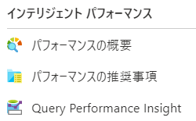
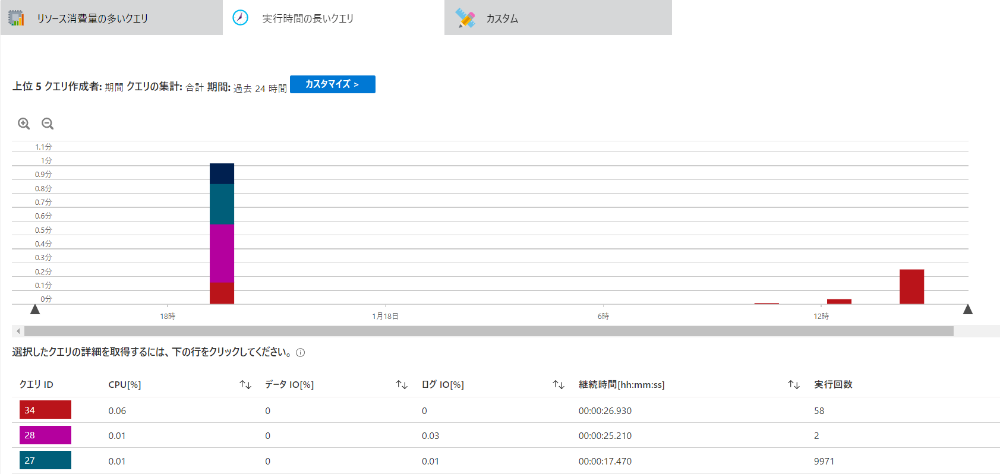
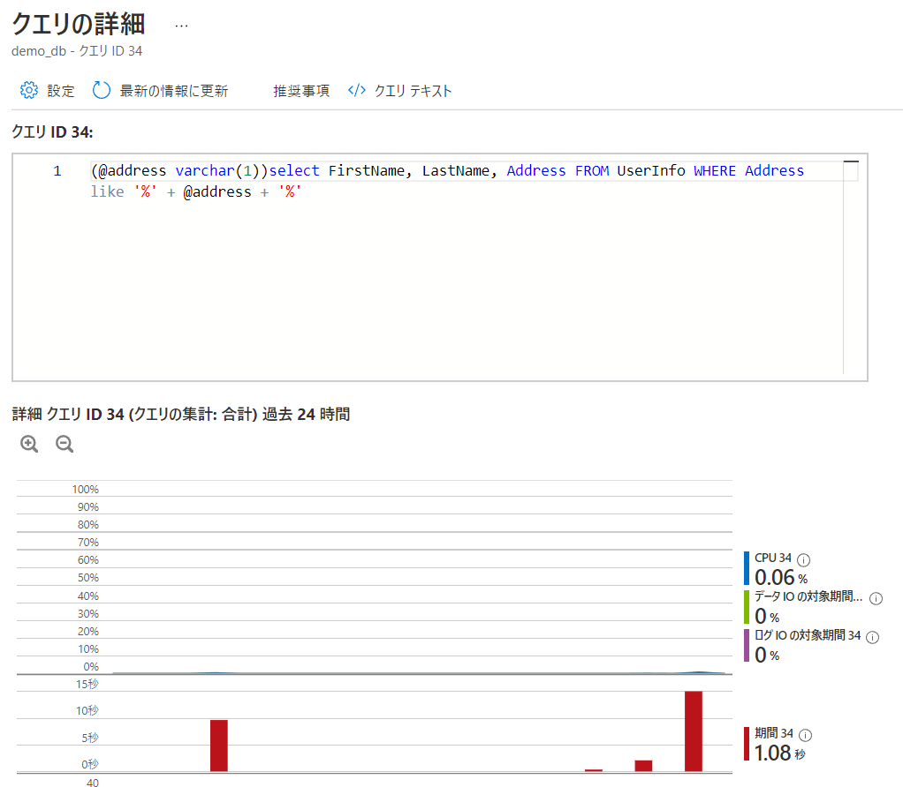

# シナリオ 6 : Web アプリケーションの画面表示が遅い

## 演習の概要とねらい
アプリケーションの問題で比較的解決が難しい、難易度の高い問題はパフォーマンスに関する問題です。システムを運用していると、ユーザー数の変化や使い方の変化等によって、アプリケーションの変更をしていなくてもシステムのパフォーマンスは変化していきます。パフォーマンスに関する問題は、いかにパフォーマンスの変化に気付けるか、その変化をどのように読み取るか、そこからどのような仮説を立てるか、という点がポイントになります。

この演習では、パフォーマンスの遅いアプリケーションのトラブルシューティングを行います。
また、実際にアプリケーションのソースコードを修正し、パフォーマンスを改善していきます。

### 演習の流れ
※このシナリオは、シナリオ 5 が完了していることが前提です。

1. アプリケーションにアクセスし、住所検索をしてみます。<br>
   最初の時点では検索に 500 ミリ秒～数秒の時間がかかっていることが分かります(時間は環境によって変わります)。
2. どのような処理に時間がかかっているかを調べます。<br>
   アプリケーションの処理で時間を要する部分の多くは依存しているコンポーネントへのアクセスです。具体的には、データベースやファイルシステム、ネットワークを介した別の API へのアクセス等です。<br>
   かかっている時間を調べるには、さまざまなやり方がありますが、一番簡単な方法はアプリケーションからログを出力する方法です。データベースへのアクセス開始前・開始後や、ファイルからの読み取り前・読み取り後にログを出力し、その時間差を確認します。<br>
   今回のアプリケーションでは、データベースへのクエリ前・クエリ後にログを出力しています。
3. アプリケーションを修正します。<br>
   アプリケーションを修正したらパフォーマンスが改善していることを確認します。Kubernetes で展開できるアプリケーションは、コンテナで実行されることを前提としているため、修正したアプリケーションをコンテナ化し、コンテナ レジストリにプッシュします。

## 準備

シナリオ 5 でアプリケーションが展開済みのため、準備は不要です。

## 現象の確認

1. `http://<Service の IP アドレス>/list` にアクセスする
2. [検索] ボタンを押す
3. `検索にかかった時間` を確認する<br>
   

## ゴール
`検索にかかった時間` を 100 msec 程度に抑える。

## ヒント

### 原因を探す
<details>
    <summary>コンテナのログを確認する</summary>

Pod のログを確認してみましょう。
```
kubectl logs <Pod 名> -f ※-f を付けることでリアルタイムにログを見ることができます。
例)
kubectl logs sampleapp-fd4d45b84-2nxb5 -f -n scenario05
```
</details>

<details>
    <summary>データベースのメトリック/Query Performance Insight を確認する</summary>

- データベースのメトリックを見てみましょう。クエリ実行時に高くなっているメトリックはありませんか？<br>
  ※ただし高くなっている = 異常ではありません。
- Query Performance Insight を見てみましょう。<br>
  どのようなクエリが実行されていますか？そのクエリをクエリ エディターから実行したらどのくらいの時間がかかりますか？<br>
  ※Query Performance Insight への反映は数分の時間を要することがあります。

#### Query Performance Insight
SQL Database でリソース消費量の多いクエリ、時間のかかっているクエリを検出できます。

Query Performance Insight は、SQL Database のリソースのメニューから確認できます。



`リソース消費量の多いクエリ` や `実行時間の長いクエリ` を確認すると、いつ何にどのくらいの負荷がかかっているクエリか、クエリが何回実行されているかが分かります。



`クエリの詳細` を確認すると実行されているクエリが分かります。



対象のクエリをクエリ エディターから実行した時にどのくらいの時間がかかるのか、どのような結果が表示されるのか、を確認することでアプリケーションの問題、データベースの問題を切り分けることができます。


</details>

<details>
    <summary>アプリケーションの実装を確認する</summary>

GitHub 上でアプリケーションの実装を確認してみましょう。データベースに対してクエリを投げているコードを見つけます。  
条件を付けずに SELECT しているコードはありませんか？

</details>

### 修正する
<details>
    <summary>アプリケーションを修正する手順</summary>

1. GitHub から clone する
2. アプリケーションのソースコードを修正する
   - ここでアプリケーションの動きを確認しておく
3. コンテナをビルドする
   - `docker build` を実行する(タグを新しくつける)
4. コンテナをリポジトリにプッシュする
   - `docker push` を実行する
5. Kubernetes のマニュフェスト(YAML ファイル)を書き換える
6. AKS に新しいコンテナを展開する
   - `kubectl apply -f <マニュフェストファイル>` を実行する

</details>

## トラブルシューティング
**※ここから下は自分で答えを見つけてから確認しましょう。**

<details>
    <summary>解決方法を見る</summary>

### 1. アプリケーションの `list.js` の修正

アプリケーションのソースコードは `app` ディレクトリ配下にあります。以下、アプリケーションに関するパスは、`app` 配下を指します。

`routes/list.js` は、`http://<IP アドレス>/list` にアクセスした際の処理を記述しているファイルです。今回問題となっている処理は、住所検索ボタンを押下した時(POSTでデータを送信した時)の、SQL をクエリする部分にあります。コードとしては以下の部分です。

```javascript
const data = await executeSQL(`select FirstName, LastName, Address FROM UserInfo WHERE Address like '%' + @address + '%'`, params);
```

このクエリはすべてのレコードの住所フィールドに対して、入力されたキーワードを含むレコードを検索しています。今回のアプリケーションでは最初の100件を取得してきているので、すべてのレコードは不要です。以下のように修正します。

```javascript
const data = await executeSQL(`select TOP 100 FirstName, LastName, Address FROM UserInfo WHERE Address like '%' + @address + '%'`, params);
```

ソースコードを修正したら正しく動作するか確認します。

```shell
# app ディレクトリにて、以下の内容を実施する
# 環境変数ファイルを作成する
vi .env

# 環境変数ファイルの例:
db_user=4dm1n157r470r
db_password=4-v3ry-53cr37-p455w0rd
db_server=demosql01.database.windows.net
db_database=demo_db
db_connectTimeoutMsec=1000

# モジュールのインストール(初回のみ)
npm i

# アプリケーションの起動
npm start
```
`http://<踏み台 VM のパブリック IP アドレス>:3000/list` にアクセスします。<br>
※ [準備](/README.md#準備) で NSG のポートを開放しているため、上記の方法でアクセスが可能です。

### 2. Docker イメージの作成とプッシュ

ソースコードの修正が完了したら、Docker イメージをビルドしてプッシュします。
今回の修正では Dockerfile の修正は不要なため、`app` ディレクトリにある Dockerfile をそのまま使用してビルドします。

```shell
# app ディレクトリにて、以下の内容を実施する
# Docker イメージをビルドします。
docker build -t <ACR のサーバー名>/sampleapp:v1.0 .
例) docker build -t demoacr01suf767168b3b3568990.azurecr.io/sampleapp:v1.0 .

# ACR にログインします。
az acr login -n <ACR 名>
例) az acr login -n demoacr01suf767168b3b3568990

# ACR にプッシュします。
docker push <イメージ名>:<タグ>
例) docker push demoacr01suf767168b3b3568990.azurecr.io/sampleapp:v1.0
```

### 3. Kubernetes のマニュフェストファイルの修正

プッシュしたイメージを使用するようにマニュフェストファイルを修正します。
シナリオ 5 のマニフェストファイルの、`image` を、先ほどプッシュしたイメージに修正します。

修正前:
```yaml
spec:
    containers:
      - image: tsubasaxzzz/aks-troubleshooting:v0.4 <----- ここ
```

修正後(例):
```yaml
spec:
    containers:
      - image: demoacr01suf767168b3b3568990.azurecr.io/sampleapp:v1.0
```

### 4. Kubernetes のマニフェストファイルの適用

修正したマニフェストファイルを適用します。

```shell
kubectl apply -f ./scenario05/deployment.yaml
```

### トラブルシューティングのポイント

アプリケーションで住所検索をすると、数百ミリ秒の時間がかかっていることが分かります。ユーザーからの入力に対し応答するアプリケーションで、百ミリ秒単位の時間は非常に遅いと感じます。アプリケーションの処理にかかる時間は、データベースへのアクセスだけでなくほかのサービス呼び出しの時間も含まれます。ユーザーの入力から関係するすべてのコンポーネントの処理の完了の積み重ねとなるため、どのコンポーネントのどの処理にどのくらいの時間がかかるのか、定常的に監視しておくことは重要です。

アプリケーションの実装を確認すると、データベースへの問い合わせで条件を付けずに `SELECT` しており、非効率なクエリになっていることが分かります。サンプルのアプリケーションのような分かりやすいクエリは実際の環境では多くはありませんが、クエリを改善することでパフォーマンスを向上できるケースはよくあります。特にデータベースへ接続するアプリケーションでは、データベースで処理を行い、取得したデータに対してアプリケーションでさらに処理を行うことになるため、どの部分に問題があるかを切り分けていくことが重要です。どのようなクエリを実行しているか、そのクエリをデータベースで実行するとどういう処理が行われるのか(実行計画の確認)、という観点は切り分けの基本です。

### Tips. アプリケーションを監視する

[演習の概要とねらい](#演習の概要とねらい) でも説明しましたが、パフォーマンスの問題を解決するには、まずは変化に気付くこと(=監視)が重要です。アプリケーションが持っているさまざまなメトリックを時間の経過とともに取得することで、いつ時点からどのようなメトリックでどういう変化があったのか、後から知ることができます。

ただし、アプリケーションやアプリケーションに関連する OS・プラットフォームにはさまざまなメトリックやログがあり、そのすべてを網羅して取得・監視することは、コストの観点、取得後の分析にかかる時間から現実的ではありません。従って必要なメトリックやログを効率よく取得し、取得したデータを迅速に分析できるようにしておくことが重要です。

では、どのようなデータを取得すればよいのでしょうか。残念ながら一般的にこれを取得しておきましょう、とお伝えできるものはありません。システムの特性を理解したうえで、そのシステムを構成するコンポーネントは何があって、そのコンポーネントはどのような監視ができるのか、どのような運用をするのか、予算はどのくらい確保できるのか、を総合的・戦略的に考える必要があります。

</details>

## 環境のクリーンアップ

```bash
# 指定の namespace のリソースをクリーンアップ
kubectl delete all --all -n scenario05
```