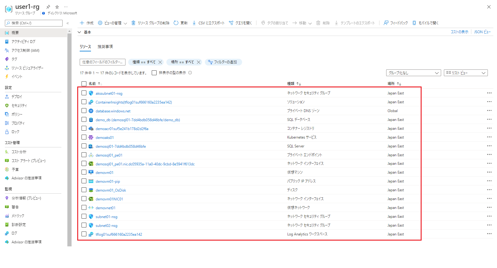

## アーキテクチャ

構築する環境の構成は以下となります。


## Requirements

+ 使用する Azure アカウントは、サブスクリプションの「所有者」権限を持っていること
+ Azure ポータルへアクセスできること

## 環境デプロイ手順

1. [Azure ポータルサイト](https://portal.azure.com/)へログインします。
2. 「Cloud Shell」を起動します。
   - 初めて Cloud Shell をご利用の場合、ポータルサイトの指示に従って構築してください。
    
3. 以下のコマンドで、GitHub から構築用ファイルをダウンロードします。
   ```bash
   git clone https://github.com/tsubasaxZZZ/aks-troubleshooting-workshop-public
   ```
4. `aks-troubleshooting-workshop/terraform/userslist` 構築するユーザー名リストを更新します。
   - ユーザーごとに改行して記載してください。
   - 作成するリソースグループ名は `ユーザー名-rg` になります。
   - 例：
    ```bash
    user1  # 作成するリソースグループ名：user1-rg
    user2  # 作成するリソースグループ名：user2-rg
    user3  # 作成するリソースグループ名：user2-rg
    ```
5. 以下のコマンドを実行して、環境デプロイ開始します。
   - １ ユーザーあたり 10 分前後かかります。
   ```bash
   cd aks-troubleshooting-workshop/terraform/
   bash main.sh
   ```
6. エラーなしで最後まで実行できたことを確認します。

## 構築後状態

- ユーザーごとにリソースグループが作成されます。
- リソースグループ内のリソースは以下のようになっています。
   
- NSG はインターネットからのアクセスをすべてブロックする状態です。

## 構築後の確認ポイント

確認として、任意のユーザーのリソースにて、以下の確認を実施してください。

- 各リソースが展開されていること
- コンテナレジストリに `sample/demoimage` が展開されていること
- SQL Database にダミーデータが展開されていること
- 踏み台用の VM にログインできること
- 踏み台用の VM に 以下のツール/ファイルがインストールされていること
  - Docker
  - kubectl コマンド
  - node コマンド
  - /home/azureuser/aks-troubleshooting-workshop-public ディレクトリ
- AKS に namespace が作成されていること
